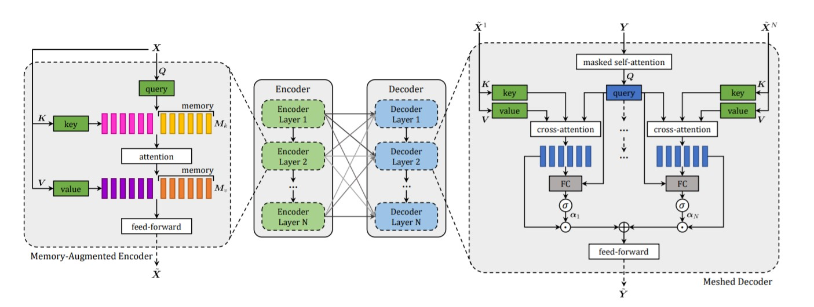
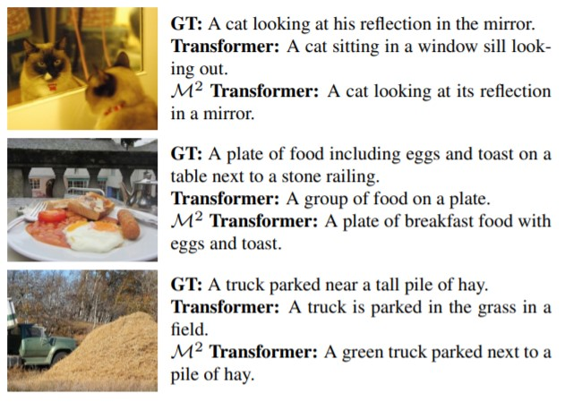

# Meshed-Memory Transformer for Image Captioning

the paper can be found [here](https://arxiv.org/pdf/1912.08226v2.pdf)

the code for the paper can be found [here](https://github.com/aimagelab/meshed-memory-transformer)

## Introduction

Transformer-based architectures represent the state of the art in sequence modeling tasks like machine translation and language understanding. Their applicability to multi-modal contexts like image captioning, however, is still largely under-explored. With the aim of filling this gap, the authors present M2 – a Meshed Transformer with Memory for Image Captioning. The architecture improves both the image encoding and the language generation steps: it learns a multi-level representation of the relationships between image regions integrating learned a priori knowledge, and uses a mesh-like connectivity at decoding stageto exploit low- and high-level features.

## Architecture

The architecture is based on the transformer model introduced in this [paper](https://arxiv.org/pdf/1706.03762.pdf). Since the transformer model is primarily built for machine translation tasks, some changes need to be made in the encoder and the decoder.

### Encoder 

The input to the encoder is a set of image regions extracted from the input image with the help of RCNN's and ResNet. The encoder applies self attention on the features which helps us generate pair wise relationships between different regions in the image ( a man and a basketball, eggs and toasts etc). However for a task such as image captioning where we have to decribe what's going on in the input image, these pairwise relationships is not sufficient. The model needs to get the sense of player/ game from the man and basketball example and the sense for breakfast with the eggs and toasts example. To incorporate this relationship the authors introduce memory augmented attention. In their proposal, the set of keys and values used for self-attention is extended with additional “slots” which can encode a priori information. To stress that a priori information should not depend on the input set X, the additional keys and values are implemented as plain learnable vectors which can be directly updated via SGD. Formally, the operator is defined as:

  where X is the image regiond and Mk and Mv are learnable matrices with nm rows, and [·, ·] indicates concatenation.

Intuitively, by adding learnable keys and values, through attention it will be possible to retrieve learned knowledge which is not already embedded in X. At the same time, this formulation leaves the set of queries unaltered.

After the self attention and the memory augmented step we pass the representations through a fully connected layer which has a residual connection with the input. After this we use the add norm operator.

We use multiple such encoding layers in a sequence. this creates a multi level encoding of the relationships between various image regions. 

### Decoder 

The decoder is conditioned on both previously generated words and region encodings, and is in charge of generating the next tokens of the output caption. To exploit multiple encodings of the image regions the authors introduced Meshed cross attention.  

Given an input sequence of vectors Y , and outputs from all encoding layers X˜, the Meshed Attention operator connects Y to all elements in X˜ through gated cross-attentions. Instead of attending only the last encoding layer (as done in the transformer model), we perform a cross-attention with all encoding
layers. These multi-level contributions are then summed together after being modulated. Formally, our meshed attention operator is defined as

 

where C(·, ·) stands for the encoder-decoder cross-attention, computed using queries from the decoder and keys and values from the encoder:

and αi is a matrix of weights having the same size as the cross-attention results. Weights in αi modulate both the single contribution of each encoding layer, and the relative importance between different layers. These are computed by measuring the relevance between the result of the crossattention computed with each encoding layer and the input query, as follows:

After the attention layer the structure of each decoder is the same as the encoder where we pass the encodings through a fully connected layer and then do the add norm with the residual connection.

One thing to note in the decoder is the masking. Since while decoding, at each time step we only know the words that the model has already predicted, we need to mask all the subsequent words.

Overall, the decoder takes as input word vectors, and the t-th element of its output sequence encodes the prediction of a word at time t + 1, conditioned on Y≤t. After taking a linear projection and a softmax operation, this encodes a probability over words in the dictionary.

## Training details

The image regions are obtained by using Faster R-CNN with ResNet-101 finetuned onthe Visual Genome dataset, thus obtaining a 2048-dimensional feature vector for each region. To represent words, we use glove embeddings and linearly project them to the input dimensionality of the model d. We also employ sinusoidal positional encodings to represent word positions inside the sequence and sum the two embeddings before the first decoding layer. In our model, we set the dimensionality d of each layer to
512, the number of heads to 8, and the number of memory vectors to 40. We employ dropout with keep probability 0.9 after each attention and feed-forward layer. In our meshed attention operator, we normalize the output with a scaling factor of √N.

## Authors Results

